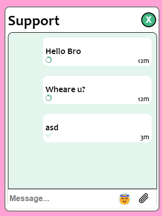

# vue-support-chat

## Этот проект еще не готов, но из-за возможной нехватки времени я решил на всякий пожарный выложить его на гит заранее. Идея проекта - сделать месенджер для сайта. Юзер жмет кнопочку в правом нижнем углу сайта, затем у него появляется возможность писать сообщение саппорту
## То, что уже есть:
### При запуске сайта - фронт получает сообщения юзера с бека по кукам. Если куков у юзера нет - бек генерирует новые и устанавливает их юзеру;
### При отправке сообщений - они отправляются на бек и добавляются юзеру в бд (аутентификация юзера происходит по кукам);
### Существует лимит на сообщения в 150 символов;
### Есть всякие анимашки, возможность добавлять к сообщениям стикеры и т.д. Проект на вью + node .js
## ToDo лист:
### Добавить отправку файлов, добавить "физику" просмотров. Стили есть, но по факту самой механики просмотров нет. Добавить админку для саппорта (хотя сразу планировалось сделать тг бота, но сайт сделать будет проще и быстрее. Мб и удобнее). Добавить обязательное заполнение формы (имя, почта) перед отправкой сообщения первого (ну а там сейвить в локале это все дело и подтягивать). Добавить имя (саппорта / юзера) в чате

